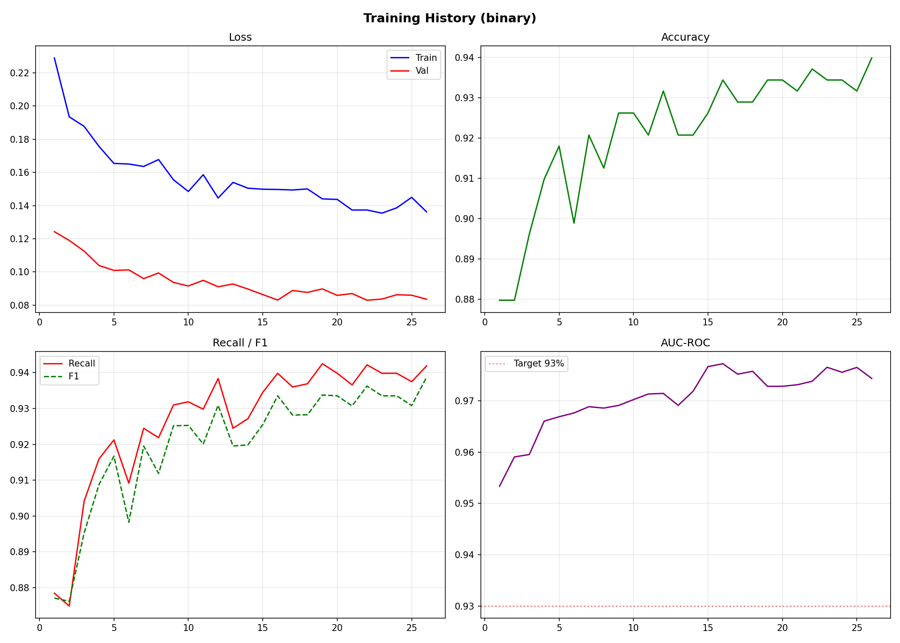
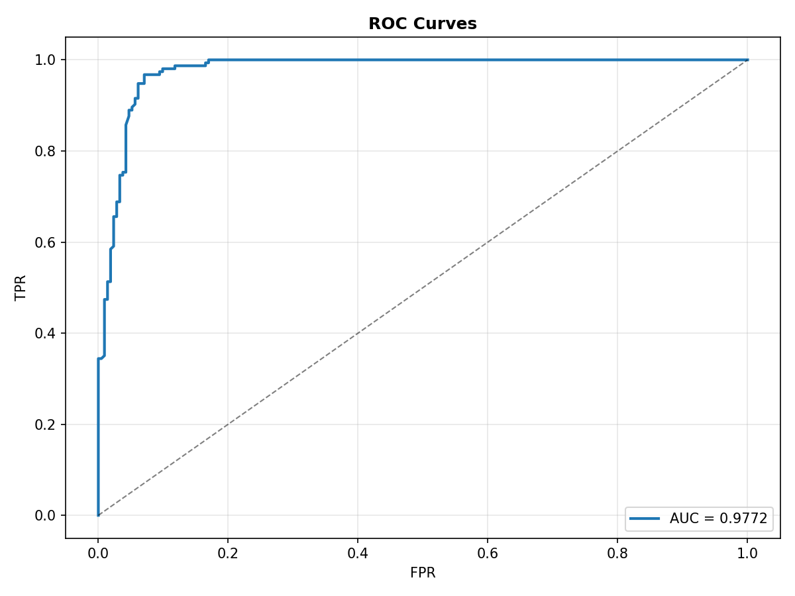

# 🏥 Diabetic Retinopathy Detection System

[](https://www.python.org/downloads/)
[](https://pytorch.org/)
[](https://fastapi.tiangolo.com/)
[](LICENSE)

> **AI-powered screening tool for Diabetic Retinopathy detection from retinal fundus photographs, achieving 97.7% AUC-ROC with Grad-CAM explainability.**

<p align="center">
  
  
</p>

---

## 📊 Performance Summary

| Metric | Value |
|--------|-------|
| **Accuracy** | 92.9% |
| **AUC-ROC** | 0.977 |
| **Recall (Sensitivity)** | 93.4% |
| **Precision** | 92.5% |
| **F1-Score** | 92.8% |
| **Referable DR Recall** | 98.7% |
| **Inference Latency** | < 2s |

> ⚠️ **Medical Disclaimer**: This is a **screening aid**, NOT a certified medical device. All predictions must be reviewed by qualified ophthalmologists.

---

## 🚀 Features

- **High Sensitivity Screening**: 98.7% recall on referable DR — misses only 1.3% of severe cases
- **Explainable AI**: Grad-CAM heatmaps highlight pathological regions (microaneurysms, hemorrhages, exudates)
- **Binary & 5-Class**: Supports both referral screening and full severity grading
- **Professional Web UI**: React interface with patient management, real-time analysis, and clinical reports
- **Production API**: FastAPI backend with Docker support, CORS, batch inference
- **GridSearch Optimized**: Systematic hyperparameter tuning across 6 configurations

---

## 💻 Tech Stack

| Layer | Technology |
|-------|-----------|
| **AI/ML** | PyTorch, EfficientNet-B0, Albumentations, Grad-CAM |
| **Backend** | FastAPI, Uvicorn, OpenCV, NumPy |
| **Frontend** | React, Vite, TailwindCSS, Framer Motion, Shadcn UI |
| **Training** | Mixed Precision (FP16), Focal Loss, Cosine Annealing |
| **DevOps** | Docker, Git |

---

## 🏁 Quick Start

### Prerequisites
- Python 3.9+
- CUDA-capable GPU (recommended) or CPU
- Node.js 18+ (for frontend)

### 1. Clone & Install
```bash
git clone https://github.com/samidardar/Brain-Tumor-detection-system-using-Deep-Learning.git
cd diabetic-retinopathy-detection

# Create virtual environment
python -m venv venv
venv\Scripts\activate       # Windows
# source venv/bin/activate  # Linux/Mac

pip install -r requirements.txt
```

### 2. Download Dataset
```bash
pip install kaggle
kaggle competitions download -c aptos2019-blindness-detection -p data/raw/
cd data/raw && unzip aptos2019-blindness-detection.zip
```

### 3. Train Model
```bash
# Standard training (binary classification)
python train_gpu.py

# GridSearch optimization
python train_v2.py
```

### 4. Run API
```bash
python api/app.py
# API docs at http://localhost:8000/docs
```

### 5. Run Frontend
```bash
cd frontend
npm install
npm run dev
# Access at http://localhost:5173
```

### 6. Docker Deployment
```bash
docker build -t dr-detection -f api/Dockerfile .
docker run -p 8000:8000 -v ./models:/app/models dr-detection
```

---

## 📁 Project Structure

```
diabetic-retinopathy-detection/
├── api/
│   ├── app.py                  # FastAPI application (predict, health, model info)
│   ├── Dockerfile              # Production Docker image
│   └── requirements.txt        # API dependencies
├── config/
│   └── config.yaml             # All hyperparameters & settings
├── src/
│   ├── data/
│   │   ├── preprocessing.py    # Fundus preprocessing (Ben Graham, auto-crop)
│   │   └── dataloader.py       # DataLoader with augmentation & sampling
│   ├── models/
│   │   ├── cnn_model.py        # EfficientNet with progressive unfreeze
│   │   └── loss_functions.py   # Focal Loss & Weighted Cross-Entropy
│   ├── training/
│   │   ├── train.py            # Training loop with mixed precision
│   │   └── optimizer_search.py # GridSearch hyperparameter optimization
│   ├── evaluation/
│   │   └── metrics.py          # AUC-ROC, confusion matrix, error analysis
│   └── inference/
│       ├── predict.py          # CLI inference with batch support
│       └── gradcam.py          # Grad-CAM interpretability
├── frontend/                   # React web application
├── docs/
│   ├── TECHNICAL_REPORT.md     # Detailed technical report
│   └── DEPLOYMENT_GUIDE.md     # Deployment instructions
├── outputs/                    # Training curves, evaluation plots
├── models/                     # Saved model checkpoints (.pth)
├── train_gpu.py                # GPU training script
├── train_v2.py                 # GridSearch training script
└── requirements.txt            # Python dependencies
```

---

## 🔬 Methodology

### Architecture
- **Backbone**: EfficientNet-B0 pretrained on ImageNet (5.3M parameters)
- **Classifier Head**: `AdaptiveAvgPool → Linear(1280, 256) → BatchNorm → ReLU → Dropout(0.3) → Linear(256, 2)`
- **Transfer Learning**: Progressive unfreezing (head first, then backbone at epoch 2)

### Training Strategy
| Component | Details |
|-----------|---------|
| **Loss Function** | Focal Loss (γ=1.5) with label smoothing (0.1) |
| **Optimizer** | AdamW (lr=5×10⁻⁴, weight_decay=0.01) |
| **Scheduler** | Cosine Annealing Warm Restarts |
| **Regularization** | Dropout (0.3), MixUp (α=0.3), Early Stopping (patience=5) |
| **Data Augmentation** | Rotation, flip, elastic transform, color jitter, CoarseDropout |
| **Precision** | Mixed precision (FP16) with gradient accumulation (4 steps) |

### Dataset
- **Source**: APTOS 2019 Blindness Detection (Kaggle)
- **Size**: 3,662 retinal fundus images
- **Task**: Binary classification (Healthy vs Referable DR)
- **Split**: 80% train / 20% validation with stratification

### GridSearch Results

| Config | Architecture | LR | Dropout | Accuracy | AUC |
|--------|-------------|-----|---------|----------|-----|
| gs_0 | EfficientNet-B0 | 3e-4 | 0.4 | 92.1% | 0.966 |
| gs_1 | EfficientNet-B0 | 1e-4 | 0.5 | 90.7% | 0.967 |
| **gs_2** ⭐ | **EfficientNet-B0** | **5e-4** | **0.3** | **92.9%** | **0.977** |
| gs_3 | EfficientNet-B3 | 2e-4 | 0.4 | 89.6% | 0.963 |

> **Winner**: Config gs_2 — EfficientNet-B0 with lr=5e-4, dropout=0.3, hidden=256

---

## 🩺 Clinical Interpretation

### Grad-CAM Visualization
The model highlights pathological regions in retinal images:
- **Microaneurysms** — Small red dots (earliest DR sign)
- **Hard Exudates** — Bright yellow/white deposits
- **Hemorrhages** — Large red patches
- **Neovascularization** — Abnormal blood vessel growth (severe DR)

### Screening Workflow
```
Patient Fundus Photo → AI Analysis (< 2s) → Grade + Confidence + Heatmap
                                                    ↓
                                        Referable? → Ophthalmologist Review
                                        Healthy?   → Routine Rescreening (12mo)
```

---

## 📋 API Endpoints

| Endpoint | Method | Description |
|----------|--------|-------------|
| `/predict` | POST | Upload fundus image → prediction + Grad-CAM |
| `/health` | GET | API health check |
| `/model/info` | GET | Model metadata (architecture, metrics) |
| `/docs` | GET | Interactive Swagger documentation |

### Example Request
```bash
curl -X POST http://localhost:8000/predict \
  -F "file=@fundus_image.jpg" \
  -F "include_gradcam=true"
```

### Example Response
```json
{
  "predicted_class": 1,
  "predicted_label": "Diabetic Retinopathy",
  "confidence": 0.8742,
  "probabilities": {"Healthy": 0.1258, "Diabetic Retinopathy": 0.8742},
  "referable": true,
  "gradcam_base64": "iVBORw0KGgo...",
  "inference_time_ms": 1247.3
}
```

---

## ⚠️ Limitations

1. **Dataset Scope**: Trained on APTOS 2019; may not generalize to all camera types or populations
2. **Image Type**: Only works with **color fundus photographs** — NOT OCT scans
3. **Not FDA/CE Approved**: Requires regulatory validation for clinical use
4. **Single Disease**: Only detects DR; does not screen for DME, glaucoma, or AMD
5. **Quality Dependency**: Poor quality images may produce unreliable predictions

---

## 🔮 Future Work

- [ ] Cross-validation (5-fold) for robust performance estimation
- [ ] External validation on EyePACS and Messidor-2 datasets
- [ ] ONNX export for edge deployment (mobile/embedded)
- [ ] Multi-task learning (DR + DME detection)
- [ ] Integration with Electronic Health Records (EHR)
- [ ] Ensemble methods for improved robustness

---

## 📚 References

1. Gulshan et al., "Development and Validation of a Deep Learning Algorithm for Detection of Diabetic Retinopathy", *JAMA*, 2016.
2. Lin et al., "Focal Loss for Dense Object Detection", *ICCV*, 2017.
3. Tan & Le, "EfficientNet: Rethinking Model Scaling for CNNs", *ICML*, 2019.
4. Selvaraju et al., "Grad-CAM: Visual Explanations from Deep Networks", *ICCV*, 2017.
5. Graham, "Kaggle Diabetic Retinopathy Detection, 1st Place Solution", 2015.

---

## 📜 License

MIT License — See [LICENSE](LICENSE) for details.

---

## 🤝 Contributing

1. Fork the repository
2. Create a feature branch (`git checkout -b feature/improvement`)
3. Commit changes (`git commit -m 'Add improvement'`)
4. Push to branch (`git push origin feature/improvement`)
5. Open a Pull Request
